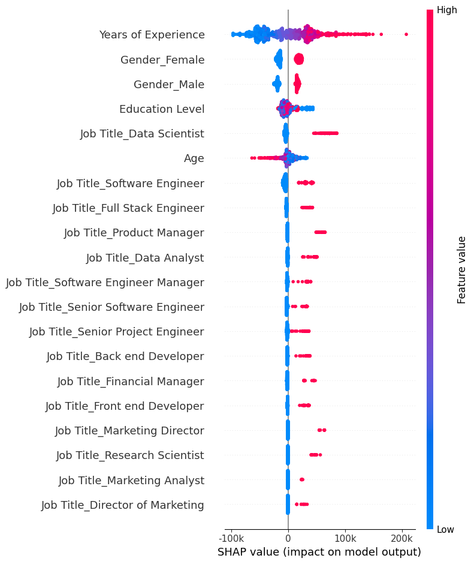

# 💼 Project #22: Salary Intelligence AI (Deep Learning & SHAP Explainability)

[](https://salary-forecasting-keras-explainability.streamlit.app/)
[](https://www.python.org/)
[](https://keras.io/)
[](https://shap.readthedocs.io/)
[](#)

An end-to-end deep learning framework and interactive Streamlit web application that predicts annual employee compensation based on demographic and professional attributes. The system integrates TensorFlow/Keras neural network regression with **SHAP (SHapley Additive exPlanations)** to provide transparent, real-time feature attribution for every prediction.

> 📱 **Mobile Engineering Highlight:** This entire machine learning pipeline—from data preprocessing and Keras model training on Kaggle/Google Colab to repository management and Streamlit Cloud deployment—was engineered and deployed entirely on a mobile device.

🚀 **Live Interactive Demo:** [salary-forecasting-keras-explainability.streamlit.app](https://salary-forecasting-keras-explainability.streamlit.app/)

---

## 📌 Features

* **Deep Learning Engine:** Multi-layer Keras Sequential Neural Network trained on preprocessed tabular compensation data.
* **Model Explainability (XAI):** Real-time local feature attribution powered by `shap.DeepExplainer`, highlighting exact dollar impact per attribute.
* **Interactive UI:** Responsive, mobile-friendly Streamlit dashboard featuring dark glassmorphic styling, Plotly gauge metrics, and parameter controls.
* **Robust Preprocessing Pipeline:** Automated handling of categorical encodings, feature scaling, and category label normalization.

---

## 📊 Model Explainability with SHAP

Machine learning models in compensation analysis often suffer from "black box" opacity. This project integrates SHAP values to explain individual predictions by measuring how much each feature pushes the predicted salary above or below the baseline dataset average.



---

## 🏗️ System Architecture & Workflow

```text
┌─────────────────────────┐
│ User Inputs (Streamlit) │ ── (Age, Experience, Gender, Education, Job Title)
└────────────┬────────────┘
             │
             ▼
┌─────────────────────────┐
│ Scikit-Learn Pipeline  │ ── (Scaling & One-Hot Encoding via preprocessor.pkl)
└────────────┬────────────┘
             │
             ▼
┌─────────────────────────┐
│ Keras Neural Network    │ ── (Reconstructed architecture + salary_nn_weights.weights.h5)
└────────────┬────────────┘
             │
             ├──────────────────────────┐
             ▼                          ▼
┌─────────────────────────┐ ┌─────────────────────────┐
│ Predicted Compensation  │ │  SHAP Local Attribution │
│   (Plotly Gauge Chart)  │ │   (DeepExplainer Chart) │
└─────────────────────────┘ └─────────────────────────┘
```

## 🧠 Neural Network Architecture

The underlying regression model is built using TensorFlow/Keras with standard dense layers and ReLU activations:

* **Input Layer:** Scaled & One-Hot Encoded Features
* **Dense Layer 1:** 256 Neurons (ReLU Activation)
* **Dense Layer 2:** 128 Neurons (ReLU Activation)
* **Dense Layer 3:** 64 Neurons (ReLU Activation)
* **Dense Layer 4:** 32 Neurons (ReLU Activation)
* **Output Layer:** 1 Neuron (Linear Activation for continuous salary regression)

---

## 📁 Repository Structure

```text
├── app.py                           # Main Streamlit web application
├── salary_nn_weights.weights.h5     # Serialized Keras neural network weights
├── preprocessor.pkl                 # Scikit-Learn preprocessing pipeline
├── feature_info.json                # Feature names, categories, and metadata
├── requirements.txt                 # Python dependency declarations
├── shap_explanation.png             # SHAP local feature attribution chart asset
└── README.md                        # Technical project documentation
```
## ⚙️ Local Installation & Run

1. **Clone the Repository:**
   ```bash
   git clone [https://github.com/M-Nafay-Ali/Salary-Forecasting-Keras-Explainability.git](https://github.com/M-Nafay-Ali/Salary-Forecasting-Keras-Explainability.git)
   cd Salary-Forecasting-Keras-Explainability
python -m venv venv
source venv/bin/activate  # On Windows: venv\Scripts\activate
pip install -r requirements.txt
streamlit run app.py
``


## 🛠️ Tech Stack

* **Frontend / Deployment:** Streamlit, Streamlit Cloud
* **Machine Learning / Deep Learning:** TensorFlow, Keras, Scikit-Learn
* **Model Interpretability:** SHAP
* **Data Visualization:** Plotly Express, Plotly Graph Objects, Pandas, NumPy


## 📞 Contact Information:-
* **Email:-**[englandengland271@gmail.com]
* **Linkedin:-**[https://www.linkedin.com/in/mohammed-nafay-ali-16519138a?utm_source=share_via&utm_content=profile&utm_medium=member_android]
* **GitHub:-**[https://github.com/M-Nafay-Ali]
